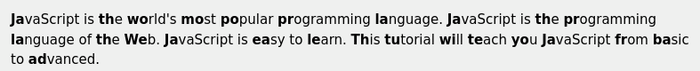
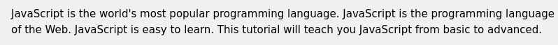

# READABLE - firefox extension

Add readability with this extension by bolding the first letters of words.

## Look

## How to use:

1. Download the code
2. Load manually by going to page about:debugging#/runtime/this-firefox
3. Click "load temporary add on"-button and then selecting manifest.json from the local files